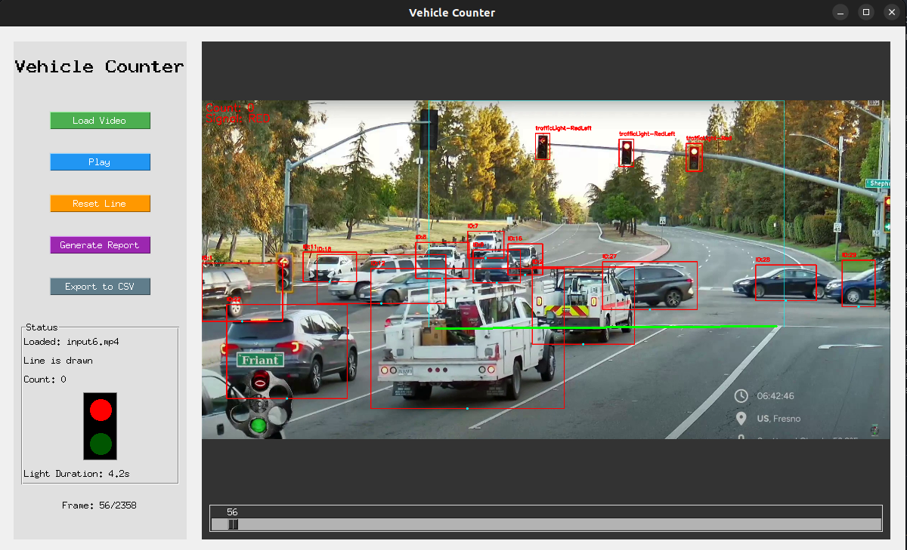

# Intelligent Traffic Light Vehicle Counting System



This repository contains the code for an intelligent real-time vehicle counting system at a traffic light.

- **Videos used:** [Friantroulette YouTube Channel](https://www.youtube.com/@friantroulette)

## Directory Structure

```plaintext
├── data/                  
│   ├── __init__.py
│   └── data_manager.py    
├── gui/                   # Graphical interface
│   ├── __init__.py
│   ├── app.py             
│   └── gui.py             
├── track/                 # Vehicle tracking
│   ├── __init__.py
│   └── tracker.py         
├── models/                # Trained model weights
│   └── model_main.pt      # <-- Place the model weights here
├── reports/               # Outputs and reports
│   ├── report.csv         # Example report in CSV format
│   └── report.png         # Example report image
├── main.py                # Application entry point
└── README.md              
```

## Prerequisites  

- Python 3.7 or higher  
- pip  

Install dependencies:

```bash
pip install -r requirements.txt
```

## Download the Model Weights

Before running the system, download the trained model weights from the following link:

[Download trained model](https://drive.google.com/file/d/12CviN5DbXcsvD0IInRRMEFROtc0dFAB5/view?usp=sharing)

The file should be placed in `models/model_main.py`.

## Usage  

Run the complete application (GUI + counting):

```bash
python main.py
```

## Initial Operation

1. In the interface, click **Load video** and select the desired video.
2. After the video loads, click two distinct points on the video preview area to define the counting baseline.
3. Click **Play** and the system will begin processing frames and display the real-time count in the interface.

## Interface Components and Logic

1. **data_manager.py**: loads and pre-processes video frames  
2. **tracker.py**: performs object-by-object vehicle tracking  
3. **gui.py / app.py**: presents the real-time interface with updated counts  
4. **main.py**: integrates all modules and starts the application

## Contact  

For questions, contact: jglg@cin.ufpe.br

